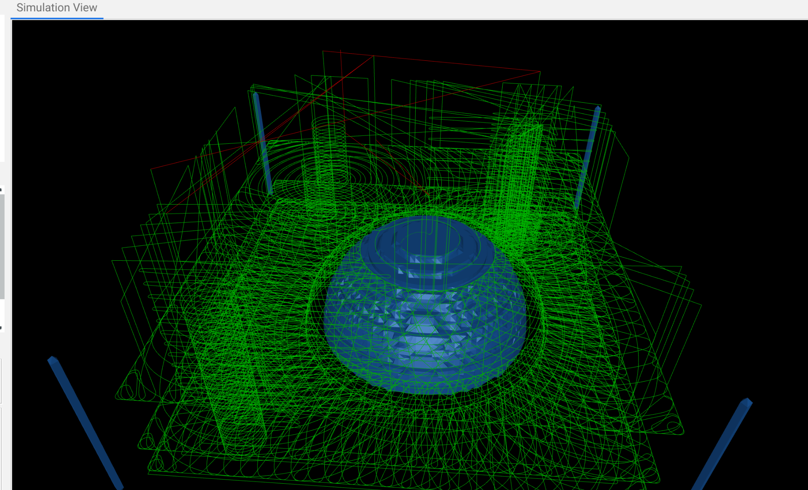

.. FenrusCNCtools ncopt documentation master file, created by
   sphinx-quickstart on Sun Oct  4 18:38:33 2020.
   You can adapt this file completely to your liking, but it should at least
   contain the root `toctree` directive.

FenrusCNCtools ncopt
====================

This module processes gcode files and will output a speed optimized version 
of this same gcode. Which optimizations are applied is configurable
in the settings above, and range from retract/plunge speed optimizations to
a more agressive use of rapids or even using dynamic feedrates. 

All computation happens locally and inside your browser, no information is 
uploaded or sent over the internet. For large files this can take 10+ seconds before the
results show up.

The tool currently only adjusts feedrates for regular endmills doing 2D operations.
3D/Vbit/ball operations are for a future addition. 
Also javascript diverges hugely between browsers; the Chrome browser is
tested the most. I'll try to make others work on a best effort basis.

The objective is to turn unoptimised gcode like this;

into optimised gcode with rapids like this;

.. image:: _static/gcode_render_after.png
   :width: 400px

.. toctree::
   :maxdepth: 2
   :caption: HTML:

   html

.. toctree::
   :maxdepth: 2
   :caption: javascript library:
   :glob:

   ncopt
   ncopt_implementation/*

Indices and tables
==================

* :ref:`genindex`
* :ref:`modindex`
* :ref:`search`
